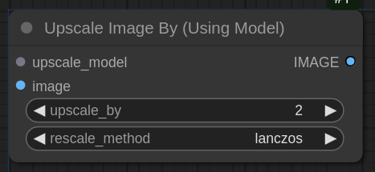

# UpscaleByModelToTotalPixels for ComfyUI

This custom node upscales an image to a target total pixel count using an upscaling model, with optional final scaling adjustments to meet divisibility constraints.

## Usage

This node performs the following steps:

1.  **Initial Upscale**: If the input image is smaller than the target resolution, it is upscaled. This can be done with an upscaling model or a standard resampling method.
2.  **Calculate Final Dimensions**: The node calculates the final dimensions required to meet the target megapixel count while preserving the aspect ratio.
3.  **Divisibility Adjustment**: The dimensions are optionally adjusted to be divisible by a specified number, which can help prevent artifacts in subsequent processing steps.
4.  **Final Resize**: The image is resized to the final calculated dimensions.

### Inputs

-   `upscale_model`: The upscaling model to use for the initial upscale.
-   `image`: The image to upscale.
-   `total_megapixels`: The target total megapixels for the output image.
-   `rescale_method`: The resampling method for any scaling operations.
-   `skip_model_upscale`: If `True`, skips the model-based upscale and uses standard resampling instead.
-   `make_divisible_by`: Ensures the final image dimensions are divisible by this number.

### Output

-   `IMAGE`: The upscaled image.

## Installation

1.  Clone this repository into ComfyUI's `custom_nodes` folder.
2.  Restart ComfyUI.
